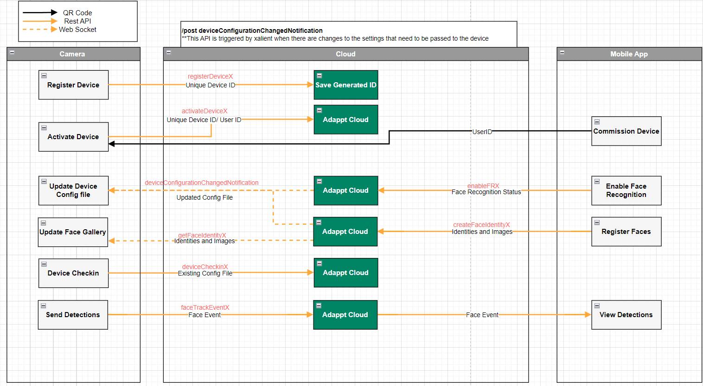

# AI Communication API Guide

This document provides a summary and guide for the APIs used to set up AI communication from camera devices with edge analytics to the Adappt cloud and from the Adappt cloud to mobile devices.

## Overview

The system architecture involves three main components:
1. **Camera Device**: Registers, activates, receives configuration, and sends face detection data.
2. **Adappt Cloud**: Manages device IDs, user IDs, configuration updates, and face recognition data.
3. **Mobile App**: Commissions devices, enables face recognition, registers faces, and views detections.

The communication between these components is facilitated through REST APIs and WebSockets.



## API Endpoints

### Postman Collection

The detailed API endpoints and their usage can be found in the Postman collection provided in this repository and most APIsreferenced here are just wrappers to xailients APIs. Import the collection to Postman to explore and test the APIs:
- [Adappt Xailient APIs Postman Collection](https://app.getpostman.com/join-team?invite_code=90d14d24038d569ce44f3d4a24dd5a6b&target_code=7c223c50df26d3b9244549471899df1e)
- [Xailient APIs](https://staging-orchestrait.xailient.com/devdocs)

### Camera Device APIs

1. **Register Device**
   - **Endpoint**: `registerDeviceX`
   - **Description**: Registers the device and generates a unique device ID.
   - **Method**: POST
   - **Payload**:
     ```json
     {
       "deviceDetails": {
         "hardwareModelName": "string",
         "uniqueDeviceId": "string"
       }
     }
     ```
   - **Response**:
     ```json
     {
       "deviceId": "string"
     }
     ```

2. **Activate Device**
   - **Endpoint**: `activateDeviceX`
   - **Description**: Activates the device using the unique device ID and user ID.
   - **Method**: POST
   - **Payload**:
     ```json
     {
        "xailientDeviceID": "string",
		"location": {"postalCode": "string", "countryCode": "string"},
		"email":"string"
     }
     ```
   - **Response**:
     ```json
     {
       "status": "success",
     }
     ```

3. **Update Device Configuration**
   - **Endpoint**: `deviceConfigurationChangedNotification`
   - **Description**: API used to update the device configuration file.
   - **Method**: POST
   - **Parameters**:
	- `xailientDeviceID`: string (query parameter)
	
   - **Example Payload**:
     ```json
			 {
			"configuredVisionCells": [
				[
					"357A6251-D22F-4B9E-A32A-5A00D0E2A101",
					3,
					{
						"dnnThreshold": 0.85
					}
				]
			],
			"deviceConfiguration": {
				"isFREnabled": true,
				"isPersonDetectionEnabled": true,
				"isPetDetectionEnabled": true,
				"isPackageDetectionEnabled": true,
				"isVehicleDetectionEnabled": true,
				"orchestraitCollectFaceData": {
					"accuracyMonitorConsent": {
						"enabledForRegisteredIdentityImages": true,
						"enabledForNonRegisteredIdentityImages": true,
						"enabledForPersonDetectionImages": true,
						"enabledForPetDetectionImages": true,
						"enabledForPackageDetectionImages": true,
						"enabledForVehicleDetectionImages": true
					},
					"productImprovementConsent": {
						"enabledForRegisteredIdentityImages": true,
						"enabledForNonRegisteredIdentityImages": true,
						"enabledForPersonDetectionImages": true,
						"enabledForPetDetectionImages": true,
						"enabledForPackageDetectionImages": true,
						"enabledForVehicleDetectionImages": true
					}
				}
			}
		}
     ```
   - **Response**:
     ```json
     {
       "status": "success",
       "message": "Configuration updated"
     }
     ```

4. **Get Face Gallery**
   - **Endpoint**: `getFaceIdentityX`
   - **Description**: Retrieves the face gallery with latest identities and images.
   - **Method**: POST
   - **Parameters**:
     - `email`: string (query parameter)
	 - `id`: string (query parameter)
   - **Response**:
     ```json
     {
       "status": "success",
       "message": "Face gallery updated"
     }
     ```

5. **Device Check-in**
   - **Endpoint**: `deviceCheckinX`
   - **Description**: Sends existing configuration file to the cloud.
   - **Method**: POST
   - **Sample Payload**:
     ```json
		 {
		"xailientDeviceID": "c6e92d22-bb1e-4593-b69d-a6c1d4030de7",
		"sdkID": "3FF9C413-2C9B-4AC9-8EED-84837E0F6681",
		"sdkVersion": 2,
		"sdkBuildVersion": "1.0.0.20230628123559",
		"errorStatistics": {},
		"visionCells": [
			[
				"357A6251-D22F-4B9E-A32A-5A00D0E2A101",
				3
			]
		],
		"galleryIdentities": {
			"54191C20-705A-4561-81FF-C261654C281F": {
				"registrationImageIDs": [
					"image-id-1",
					"image-id-2"
				],
				"accuracyMonitorConsent": true,
				"productImprovementConsent": false
			},
			"DBE9507B-0799-4409-B836-5B4F47DC5937": {
				"registrationImageIDs": [
					"image-id-56",
					"image-id-57"
				],
				"accuracyMonitorConsent": true,
				"productImprovementConsent": true
			},
			"configuration": {
				"deviceConfiguration": {
					"isFREnabled": true,
					"isPersonDetectionEnabled": true,
					"isPetDetectionEnabled": true,
					"isPackageDetectionEnabled": true,
					"isVehicleDetectionEnabled": true,
					"orchestraitCollectFaceData": {
						"accuracyMonitorConsent": {
							"enabledForRegisteredIdentityImages": true,
							"enabledForNonRegisteredIdentityImages": true,
							"enabledForPersonDetectionImages": true,
							"enabledForPetDetectionImages": true,
							"enabledForPackageDetectionImages": true,
							"enabledForVehicleDetectionImages": true
						},
						"productImprovementConsent": {
							"enabledForRegisteredIdentityImages": true,
							"enabledForNonRegisteredIdentityImages": true,
							"enabledForPersonDetectionImages": true,
							"enabledForPetDetectionImages": true,
							"enabledForPackageDetectionImages": true,
							"enabledForVehicleDetectionImages": true
						}
					}
				}
			}
		},
		"email": "sagar@adappt.com"
	}
     ```
   - **Response**:
     ```json
     {
       "status": "success"
     }
     ```

6. **Send Face Recognition Detections**
   - **Endpoint**: `faceTrackEventX`
   - **Description**: Sends face detection events to the cloud.
   - **Method**: POST
   - **Payload**:
     ```json
     {
       "deviceId": "string",
       "event": {   
			"xailientDeviceID":"c6e9f850-5db5-4962-8d88-cc733003bc99",
			"eventType": "IDENTITY_NOT_IN_GALLERY",
			"faceTrackID": 1234,
			"identityID": "",
			"identityName": "",
			"eventTime": 1679084284,
			"metadata": {
				"faceBoundingBox": {
					"xmin": 10,
					"ymin": 20,
					"xmax": 30,
					"ymax": 40
				},
				"distance": 0.1234,
				"detectedBoundingBox": {
					"xmin": 11,
					"ymin": 21,
					"xmax": 31,
					"ymax": 41
				},
				"detectionConfidence": 0.789,
				"landmarks": {
					"leye_x": 15,
					"leye_y": 25,
					"reye_x": 25,
					"reye_y": 24,
					"nose_x": 20,
					"nose_y": 30,
					"lmouth_x": 15,
					"lmouth_y": 32,
					"rmouth_x": 25,
					"rmouth_y": 32
				},
				"landmarksConfidence": 0.834,
				"normalizedBoundingBox": {
					"xmin": 5,
					"ymin": 6,
					"xmax": 34,
					"ymax": 45
				}
		},
		"registrationImage": "... base64 encoded text goes here ...",
		"looselyCroppedImage": "... base64 encoded text goes here ...",
		"forwardImagesToOrchestrait": true
	}
     }
     ```
   - **Response**:
     ```json
     {
       "status": "success"
     }
     ```

### Mobile App APIs

1. **Enable Face Recognition**
   - **Endpoint**: `/enableFRX`
   - **Description**: Enables face recognition on the camera.
   - **Method**: POST
   - **Payload**:
     ```json
     {
		"xailientDeviceID": "string",
		"customerFREnabled": "boolean",
		"userFREnabled": "boolean",
		"email": "string"
	}
     ```
   - **Response**:
     ```json
      {
		"customerFREnabled": "boolean",
		"userFREnabled": "boolean",
		"isFREnabled": "boolean"
	  }
     ```

2. **Register Faces**
   - **Endpoint**: `/createFaceIdentityX`
   - **Description**: Registers faces with identities and images.
   - **Method**: POST
   - **Parameters**:
	- `email`: string (query parameter)
	- `name`: string (query parameter)
	- `location`: string (query parameter)
	- `device`: string (query parameter)
	
   - **Payload**:
     ```
		 'json' - str (content-type: application/json). A dict of the following
		accuracyMonitorConsent: bool. True if the identity has consented to information associated with them to be used
			for Orchestrait accuracy monitoring purposes; false otherwise.
			This setting must be specified. If it is missing a `BAD_REQUEST` is returned.
		productImprovementConsent: bool.True if the identity has consented to information associated with them to be used
			for Orchestrait product improvement purposes; false otherwise.
			This setting must be specified. If it is missing a "BAD_REQUEST" is returned.  
		registrationImage_<<image file name-1>>.jpg - [binary] content-type: image/jpg. 112x112 images of the faces that will be identified as "name".
		registrationImage_<<image file name-2>>.jpg - [binary] content-type: image/jpg. 112x112 images of the faces that will be identified as "name".
		...
		registrationImage_<<image file name-N>>.jpg - [binary] content-type: image/jpg. 112x112 images of the faces that will be identified as "name".
		looselyCroppedImage_<<image file name-1>>.jpg - [binary] content-type: image/jpg. Loosely cropped images of the faces that will be identified as `name`.
		looselyCroppedImage_<<image file name-2>>.jpg - [binary] content-type: image/jpg. Loosely cropped images of the faces that will be identified as `name`.
		...
		looselyCroppedImage_<<image file name-N>>.jpg - [binary] content-type: image/jpg. Loosely cropped images of the faces that will be identified as `name`.

     ```
   - **Response**:
     ```
		id - str. A unique ID for the corresponding `Identity` object in Xailient's backend.
		devicePoolID - str.
		name - str. The name of the identity.  This is always empty.
		accuracyMonitorConsent - bool.
		productImprovementConsent - bool.
		registrationImageIDs - [str]. The unique IDs of the images registered to this identity.
     ```


## Conclusion

This guide provides a high-level overview of the APIs involved in setting up and managing AI communication between camera devices, the Adappt cloud, and mobile applications. For detailed API specifications, refer to the Postman collection and the architecture diagram.

